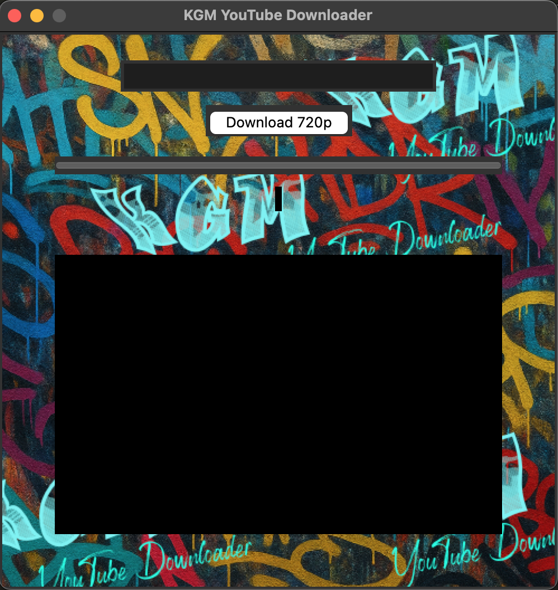

# KGM-YouTube-Downloader
# KGM-YouTube-Downloader
<p align="center">
  
</p>

<h1 align="center">🎬✨ KGM YouTube Downloader 🎧⬇️</h1>

<p align="center">
  A sleek, simple, and stylish desktop app to download your favorite YouTube videos & playlists in high quality — built with ❤️ using Python & Tkinter.
</p>

---

## 🧩 Features

- 🎥 Download videos 
- 📦 Full **playlist support** with individual progress
- ✅ Checkmark shows completed downloads
- 🔍 Fetch video info & formats before downloading
- ⚙️ Built-in **progress bar**
- 📁 Automatically saves to your chosen folder

---

## 💻 Preview

> *"Simple UI with real-time download status"*



---

## 🚀 Getting Started

### 🛠️ Install Requirements
Make sure `yt-dlp` and `ffmpeg` are installed:

```bash
pip install yt-dlp
brew install ffmpeg  # Or follow manual steps if you're not using Homebrew
