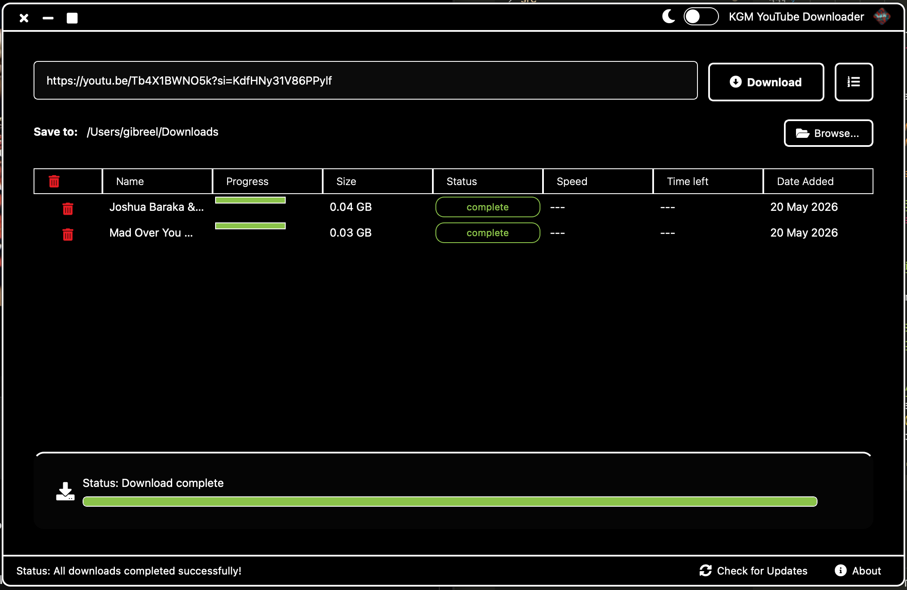
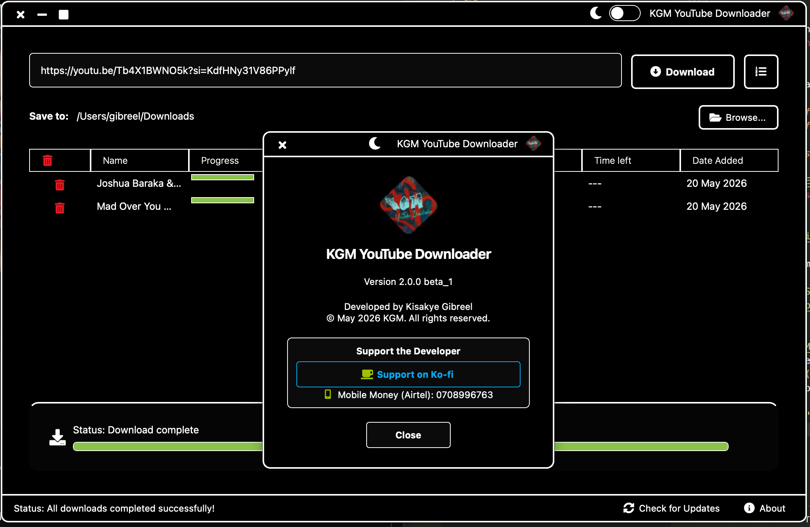

# KGM-YouTube-Downloader
<p align="center">
  
</p>

<h1 align="center">🎬✨ KGM YouTube Downloader 🎧⬇️</h1>

<p align="center">
  A sleek, modern, and high-performance cross-platform desktop application to download your favorite YouTube videos in top-tier quality — built with ❤️ using Python & PySide6 (Qt).
</p>

---

## 🧩 Features

- ⚡ **Asynchronous Worker Pipelines:** UI remains perfectly responsive during metadata extraction and active downloads.
- 🎨 **Dynamic Dual Themes:** Toggle instantly between gorgeous `Dark Neon` and `Light Neon` stylesheets.
- 📦 **Zero Configuration Setup:** Pre-bundled with platform-specific `yt-dlp` and `ffmpeg` binaries.
- 🚀 **Persistent Engine Upgrades:** Built-in updater drops fresh parsing definitions straight into user spaces to beat YouTube algorithm changes.
- 📊 **Detailed Progress Tracking:** Displays real-time download percentages, transfer speeds, and exact ETA indicators.
- 💾 **Integrated Download Ledger:** Local history database tracks your past downloads effortlessly.

---

## 💻 Preview

### Main App UI & Theming
<p align="center">
  
</p>

### About & System Architecture
<p align="center">
  
</p>

---

## 🚀 Getting Started

### 🛠️ Local Environment Setup
Clone the repository and spin up your python virtual environment layout:

```bash
git clone [https://github.com/yourusername/KGM-YouTube-Downloader.git](https://github.com/yourusername/KGM-YouTube-Downloader.git)
cd KGM-YouTube-Downloader

# Setup virtual environment
python -m venv .venv
source .venv/bin/activate  # On Windows use: .venv\Scripts\activate

# Install required packages
pip install -r requirements.txt